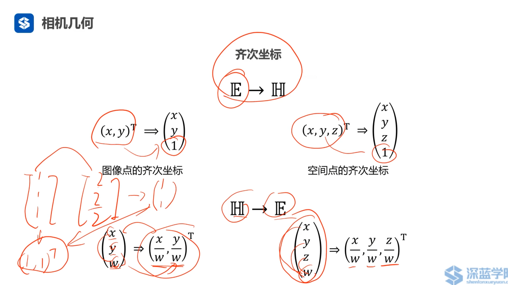
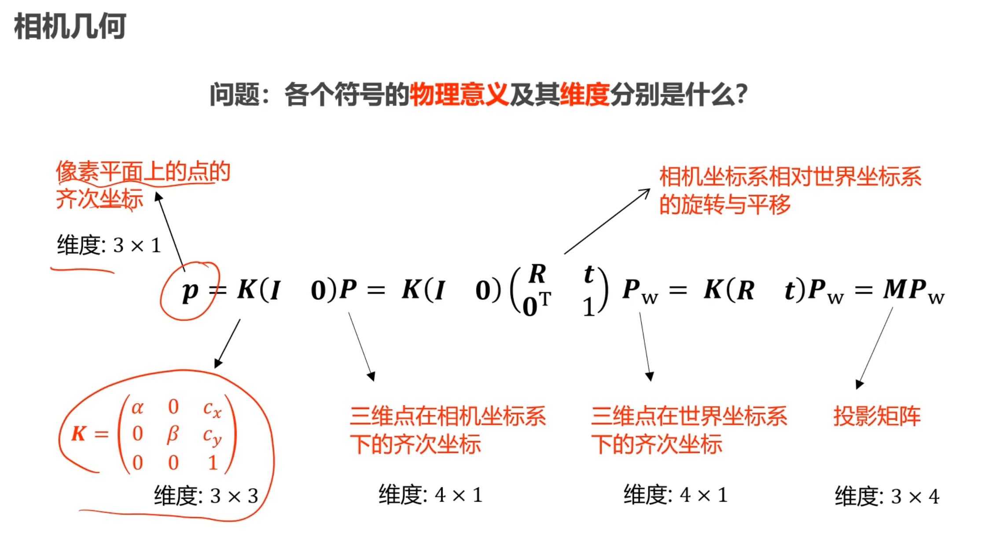

# 第1章 摄像机几何与运动恢复结构

## 1.1 三维重建：显示建模与隐式建模

Nerf是三维重建的一种技术。

**三维重建：**给定一个场景的多个视角的图像，我们获得这个三维场景。但VGGT单张图片可以。以下是三维重建的4个步骤。

1. **运动恢复结构(SFM)：**
    - 输入：
        - 多视角图像
        - 相机内参
    - 输出：
        - 稀疏三维点云
        - 相机外参(相机位姿T)

2. **多视立体视觉(MVS)：**
    - 输入：
        - 多视角图像
        - 摄像机内、外参数
        - 稀疏三维点云
    - 输出：
        - 稠密三维点云

3. **表面重建：**
建模是为了可视化和物理仿真，但是点云受限于自身性质。有了表面模型其实就可以做物理仿真。
    - 输入：
        - 稠密点云
    - 输出：
        - 场景/模型的三维网格

4. **纹理重建：**
为每个点找RGB值，把RGB值高效的存储。主要作用是可视化。

    - 输入：
        - 多视角图像
        - 摄像机内、外参数
    - 输出：
        - 场景/模型的纹理图像

三维重建过程中会产生**空洞**。

**神经辐射场(Neural Radiance Fields, NeRF)：**
三维重建被记录在神经网络的权值里，而不是表面重建和纹理重建中。隐式学习了三维场景的场景信息和色彩信息。

    
    <a id = "fig-1">图 1 神经辐射场pipeline</a>

- 优势：
    - 简洁。
    - 逼真。
- 劣势
    - 不好进行物理仿真。

## 1.2 摄像机内外参数及其获取方法

NERF必备知识：

- 摄像机集合与运动恢复结构(SFM)
- 全连接神经网络(本课程不介绍)，还有卷积神经网络，transformer等。
- 损失函数，L1 L2
- 优化方法
    - SGD随机梯度下降
    - Momentum加动量的
    - Adam优化器
- 过拟合与欠拟合的概念
    - 过拟合：模型在训练数据上的表现好，但是在测试数据上的表现差。
    - 欠拟合：模型在训练数据上的表现差，但是在测试数据上的表现也差。

摄像机几何与运动恢复结构

- 摄像机几何
- 三角化与极几何
- 运动恢复结构(SFM)

## 1.3 什么是摄像机的内外参数

针孔相机模型，可以参考《视觉SLAM十四讲》中的内容。

O = 光圈 = 针孔 = 相机中心

将小孔成像取负值，把图像摆正。称为虚拟像平面。

内参中的cx, cy是偏置，是像素坐标系与摄像机坐标系的平移转换，单位是像素。

fx, fy是缩放因子，是像素坐标系与物体坐标系的缩放转换，单位是像素。通过焦距f与传感器像素/米转换单位得到(早期工艺不好，传感器x,y方向像素不同，因此有fx, fy)。

三维世界点P到像素平面点p的变换不是线性变换，fx/z中z是变量。提取缩放因子s(1/z)，得到齐次坐标，就转化为线性变换了。

一个欧式坐标对应多个齐次坐标，但是一个齐次坐标只能对应一个欧式坐标。转换关系如[图 2](#fig-2)

     
    <a id = "fig-2">图 2 齐次坐标与欧式坐标转换</a>

$$
p = K(I | 0)P = K(I 0) (R | t)P_{W} = K(R | t)P_{W} = M P_{W}
$$

这里M被称为投影矩阵。注意，M是一个3x4的矩阵，$P_{W} -> P$经历了一次齐次变换。

如[图 3](#fig-3)所示，世界坐标系点P_{W}转换到像素坐标系点p的过程中，展示了公式及各个参数的意义。

     
    <a id = "fig-3">图 3 世界坐标系点转换到像素坐标系点公式及物理意义</a>

> 如何获得相机的内参数K? &emsp; 答：EXIF信息。

## 1.4 运动恢复结构基础：三角化与极几何

具体可以翻阅《视觉SLAM十四讲》第7讲内容。

## 1.5 运动恢复结构

**Structure-from-Motion(SFM) 运动恢复结构：**通过三维场景的多张图像，恢复出该场景的三维结构信息以及每张图像的摄像机参数(外参)。

欧式结构恢复(已知相机内参K，求相机外参T)的求解步骤如下：

1. 求解基础矩阵F，$p_2^T F p_1 = 0$
2. 求解本质矩阵$E = K_2^T F K_1$
3. 分解本质矩阵$E \rightarrow R与t$， $E =  t^{\wedge} R$ 
4. 三角化求解深度z或者说尺度s。

N视图情况下，有两种方法**增量法**和**BA(Bundle Adjustment) 捆绑调整**。

**增量法：**分别对每一个图像计算运动与结构。**缺点：**易出现误差累积。

**BA(Bundle Adjustment) 捆绑调整：**恢复结构和运动的非线性方法。最小化重投影误差。

## 1.6 小结

内参由EXIF信息获得。外参由运动恢复结构(SFM)获得。可以使用`Colmap`，`Metashape`等软件。