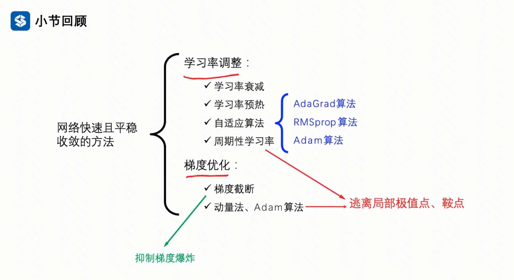

# Ch2 全连接神经网络与优化算法

## 2.1 优化算法

### 2.1.1 梯度下降法(SGD)

两个超参数：
- 学习率$\alpha$(learning rate)：控制每次更新的步长，过大可能导致震荡，过小可能导致收敛缓慢。
- 样本数量$K$(batch size)：控制每次更新使用的样本数量，过大可能导致内存不足，过小可能导致优化不稳定。

> 经验  
1) K越大越好，匹配显存大小。
2) 学习率与样本数量成正比关系。K放大几倍$\alpha$相应放大几倍。

### 2.1.2 动量梯度下降法(Momentum SGD)

## 总结

通常首选动量梯度下降法(Momentum SGD)，实际上一般是Mini batch SGD。次选Adam 优化器，动量+RMSProp。

## 思考：

Adam那么棒，为什么还常用动量梯度下降法(Momentum SGD)？

## 补充：

**梯度折断(gradient clipping)：**一种比较简单的启发式方法，把梯度的模限定在一个区间，当梯度小于或大于这个区间时就进行截断。

$$
g(t) = max(min(g(t), clip\_max), clip\_min)
$$

本章小结如下：

     
    <a id="fig-1">图 1 常见优化算法</a>

