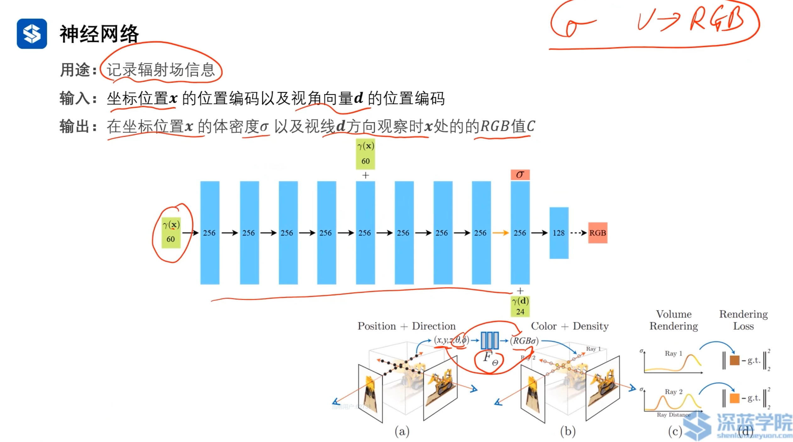
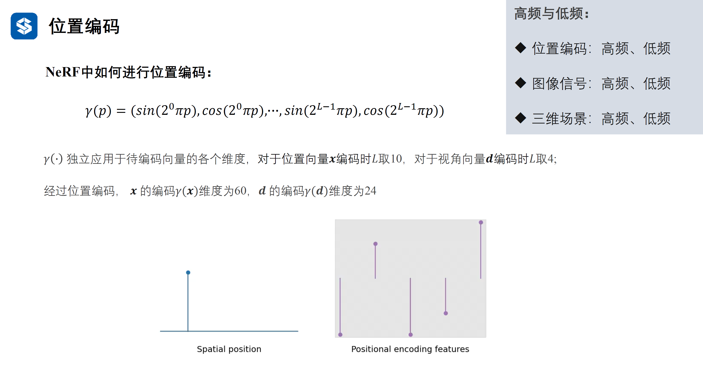

# Ch3 Nerf基础：Nerf开山之作

## 3.1 神经辐射场 Nerf:Representing Scenes as Neural Radiance Fields for View Synthesis

     
    <a id="fig-1">图 1 Nerf_steps</a>

辐射场里学习了辐射值，可以将辐射值类比为光线。将来看某个图像，就是将三维视角的光投影到图像上。

接下来讲解论文中几个概念

### 3.1.1 神经辐射场

     
    <a id="fig-2">图 2 神经辐射场概念</a>

Nerf考虑了三维空间中的所有点，生成了一个像素，[图 2](fig-2)中的(a)所示。这就是体渲染技术。

**三维场景：**

- 三维点在空间中的坐标值。
- 体密度和三维场景中物体的材质有关，比如空气和拖拉机上的点，材质就不同。
- 不同观察角度下，颜色值C不同。即使是同一个点。同时考虑了镜面反射，不同角度看反射光效果是不一样的。

pipeline:
- 训练流程：
    - 训练与推断不同在于，训练会将训练的输出与真实值形成损失，通过反向传播更新网络参数，使得损失最小化，从而是网络输出与真实值更接近。
- 推断流程：
    - 从图像中提取射线(从每个像素点出发，不同方向$(\theta, \phi)$发射射线)。
    - 对每个射线，从近到远采样N个点。获得每个点的颜色C和体密度。通过体渲染技术，获得每个像素点的颜色值C。
    - 对每个射线，使用神经网络预测颜色值C。
    - 将所有射线的颜色值C合并起来，得到最终的图像。

## 3.2 详解体渲染技术

     
    <a id="fig-3">图 3 体渲染视线</a>

$T(t) = exp^{-\int_{t_n}^{t} \sigma(r(s)) ds}$ 可以理解为还剩下多少光强，范围为0-1。随着光的辐射，强度会逐渐下降的，后面的点即使有体密度有颜色值，但都被前面的点把光吸收了，因此对像素上的点无贡献。其实就是一个权重值，代表了该点对像素上的颜色值的贡献程度。

$\sigma = 0$代表该点无体密度，对光强无贡献，对像素上的颜色值无贡献。
$T(t) = 0$代表该点无光强，对像素上的颜色值无贡献。
$\sigma$越大$T$越大$C(r(t),d)$越大。

     
    <a id="fig-4">图 4 体渲染_连续</a>

真实情况无法积分，只能离散。
为了防止均匀分布采样时，相邻采样间隔大，导致结果与实际相差太大，提出层次采样方法。

     
    <a id="fig-5">图 5 体渲染_离散</a>

$\sigma_i \quad c_i$在神经网络中可知，$\delta_i$是相邻两个采样点间的距离。

## 3.3 神经网络与位置编码

     
    <a id="fig-6">图 6 Nerf_全连接神经网络</a>

Nerf使用全连接神经网络，将位置x升级通过位置编码函数$\gamma(x)$，升级到60维度的空间中。

中途还要把位置信息与神经元的输出拼接起来。

第8层会输出一个$\sigma$值(不受视角影响)和一个特征向量。将256提取新特征与光线方向编码$\gamma(d)$拼接起来，送给一个128的全连接层，输出一个3维向量，代表颜色值。

大部分激活函数使用ReLU。只有最后一层`128->RGB`使用Sigmoid函数，将输出映射到0-1范围。

- 视角信息(d)作用：缺失会造成没有反光，镜面反射消失了。
- 位置编码作用：防止高频几何和纹理细节丢失。

> 通俗的讲，高频就是差异，低频就是平滑。

| 项目 | 高频 | 低频 |
| :--: | :--: | :--: |
| 位置编码 | 包含高频正弦和余弦函数，对应高频几何和纹理细节 | 原始位置坐标，对应低频几何信息 |
| 图像信号 | 表示图像中变化剧烈的区域，如边缘、纹理、噪声等，对应细节和锐利部分 | 表示图像中变化缓慢的区域，如大面积的颜色一致区域，对应平滑部分 |
| 三维场景 | 高频几何（凹凸纹理、尖锐边缘）和纹理细节（精细图案、微小结构） | 低频几何（整体形状、大型平面）和纹理细节（渐变、大面积一致的纹理） |

### 高频与低频的详细说明

#### 位置编码中的高低频
- **低频部分**：原始三维坐标信息(x,y,z)，主要表示物体的基本形状和位置
- **高频部分**：通过位置编码函数引入的高频信息：
  - 使用正弦和余弦函数，将输入坐标映射到更高维度的空间
  - 捕捉细节和复杂的几何结构
  - 帮助神经网络学习高频几何和纹理细节

     
    <a id="fig-7">图 7 Nerf_位置编码</a>

x和d都是3维的，有$3 \times 2L$个维度。

#### 图像信号的高低频特性
- **高频特性**：
- 包含图像的边缘、纹理和细节信息
- 在频域中对应高频率部分
- 对噪声敏感
- 决定图像的清晰度和细节表现
- **低频特性**：
- 表示图像的平滑区域
- 包含主要的形状和轮廓信息
- 能量通常较高
- 受噪声影响较小

#### 三维场景的高低频特性
- **高频几何**：
- 表示场景中的细节结构，如物体表面的凹凸、锐利边缘等
- 对应小尺度的几何变化
- 需要高分辨率的数据表示
- **低频几何**：
- 表示场景的整体结构和大尺度形状
- 对应空间中缓慢变化的几何体
- 可由低次多项式或平滑基函数近似表示

#### 在NeRF中的重要性
- 神经网络天然倾向于学习低频信息，难以捕捉高频细节，因为图像中通常低频信息占比更多
- 位置编码通过将输入映射到高频空间，使网络能够有效学习高频几何和纹理细节
- 高频信息对于实现真实感渲染至关重要，决定了渲染结果的细节表现和真实感
