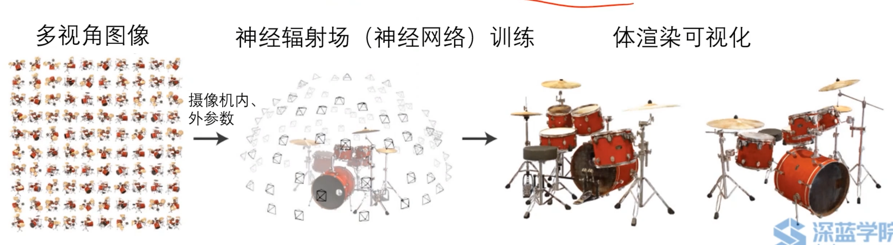
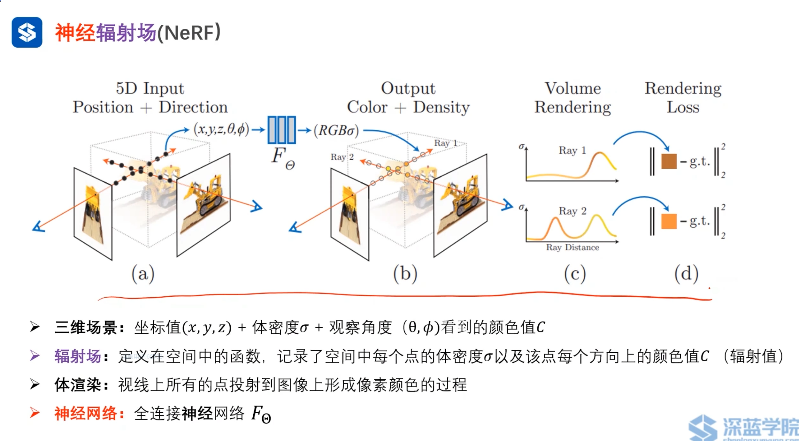
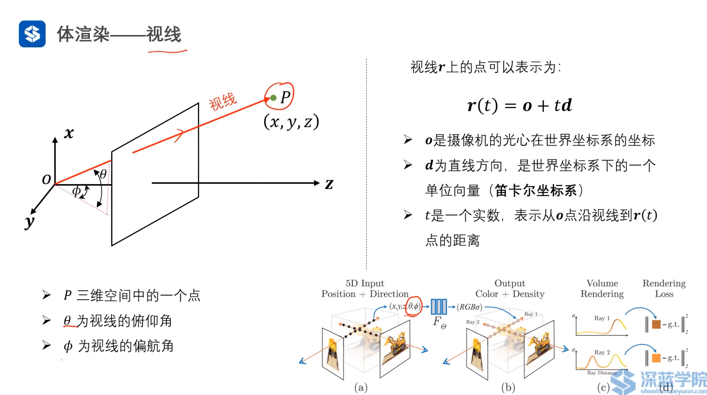
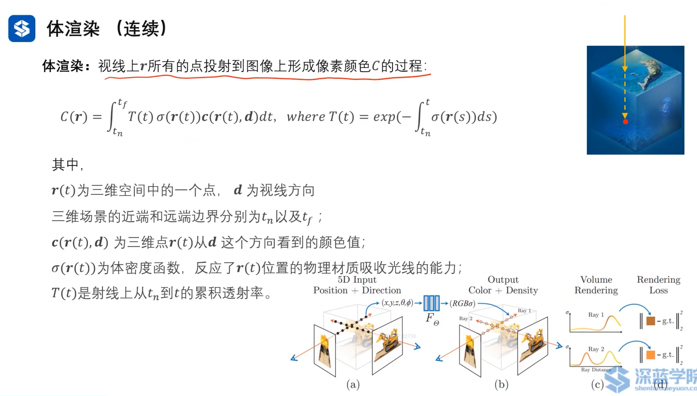
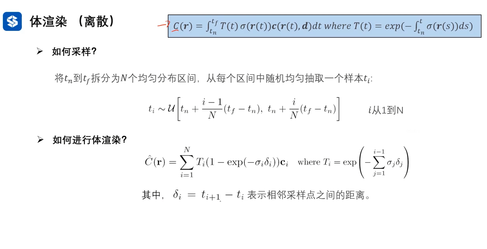

# Ch3 Nerf基础：Nerf开山之作

## 3.1 神经辐射场 Nerf:Representing Scenes as Neural Radiance Fields for View Synthesis

     
    <a id="fig-1">图 1 Nerf_steps</a>

辐射场里学习了辐射值，可以将辐射值类比为光线。将来看某个图像，就是将三维视角的光投影到图像上。

接下来讲解论文中几个概念

### 3.1.1 神经辐射场

     
    <a id="fig-2">图 2 神经辐射场概念</a>

Nerf考虑了三维空间中的所有点，生成了一个像素，[图 2](fig-2)中的(a)所示。这就是体渲染技术。

**三维场景：**

- 三维点在空间中的坐标值。
- 体密度和三维场景中物体的材质有关，比如空气和拖拉机上的点，材质就不同。
- 不同观察角度下，颜色值C不同。即使是同一个点。同时考虑了镜面反射，不同角度看反射光效果是不一样的。

pipeline:
- 训练流程：
    - 训练与推断不同在于，训练会将训练的输出与真实值形成损失，通过反向传播更新网络参数，使得损失最小化，从而是网络输出与真实值更接近。
- 推断流程：
    - 从图像中提取射线(从每个像素点出发，不同方向$(\theta, \phi)$发射射线)。
    - 对每个射线，从近到远采样N个点。获得每个点的颜色C和体密度。通过体渲染技术，获得每个像素点的颜色值C。
    - 对每个射线，使用神经网络预测颜色值C。
    - 将所有射线的颜色值C合并起来，得到最终的图像。

## 3.2 详解体渲染技术

     
    <a id="fig-3">图 3 体渲染视线</a>

$T(t) = exp^{-\int_{t_n}^{t} \sigma(r(s)) ds}$ 可以理解为还剩下多少光强，范围为0-1。随着光的辐射，强度会逐渐下降的，后面的点即使有体密度有颜色值，但都被前面的点把光吸收了，因此对像素上的点无贡献。其实就是一个权重值，代表了该点对像素上的颜色值的贡献程度。

$\sigma = 0$代表该点无体密度，对光强无贡献，对像素上的颜色值无贡献。
$T(t) = 0$代表该点无光强，对像素上的颜色值无贡献。
$\sigma$越大$T$越大$C(r(t),d)$越大。

     
    <a id="fig-4">图 4 体渲染_连续</a>

真实情况无法积分，只能离散。
为了防止均匀分布采样时，相邻采样间隔大，导致结果与实际相差太大，提出层次采样方法。

     
    <a id="fig-5">图 5 体渲染_离散</a>

$\sigma_i \quad c_i$在神经网络中可知，$\delta_i$是相邻两个采样点间的距离。
